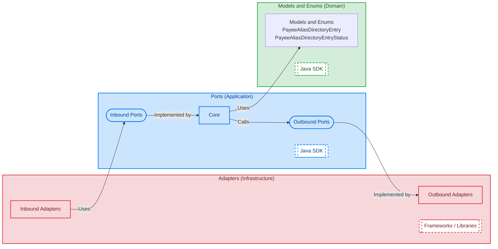
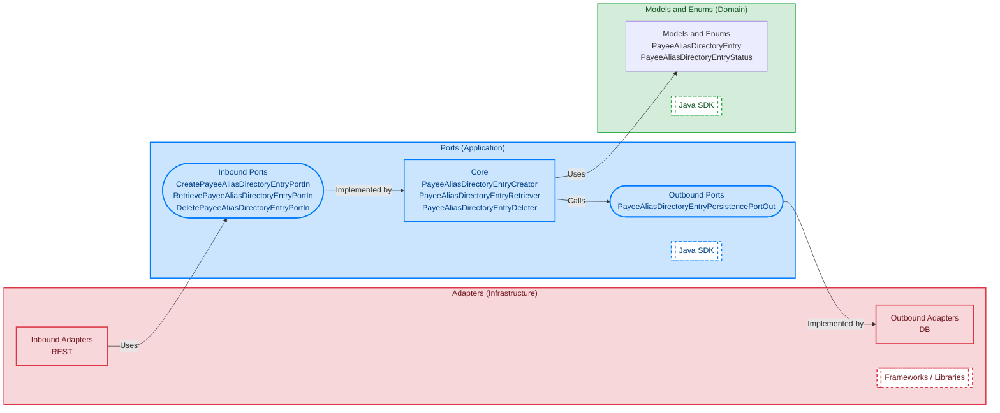
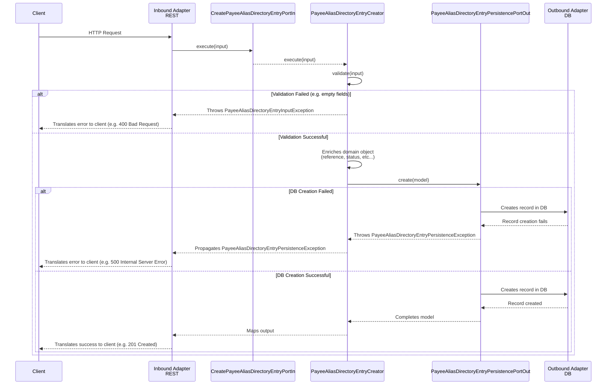

# Hexagonal Reference

## Overview

Reference project for **Hexagonal** architecture implementing the functionality defined for the BIAN domain [Payee Alias Directory Entry](https://bian.org/servicelandscape-14-0-0/object_13.html?object=157353):

- Create **Payee Alias Directory Entry**
- Retrieve **Payee Alias Directory Entry**
- Delete **Payee Alias Directory Entry**

## Diagrams

### Domain



### Application



#### Sequence - Create Payee Alias Directory Entry



## Build

### Requirements

- [Docker](https://docs.docker.com/engine/install/)

### Run

```shell
docker run \
  --rm \
  -w $(pwd) \
  -v $(pwd):$(pwd) \
  -v ${HOME}/.m2:/root/.m2 \
  azul/zulu-openjdk-alpine:25.0.1 \
  ./mvnw -Djansi.force=true -ntp -U clean install
```

